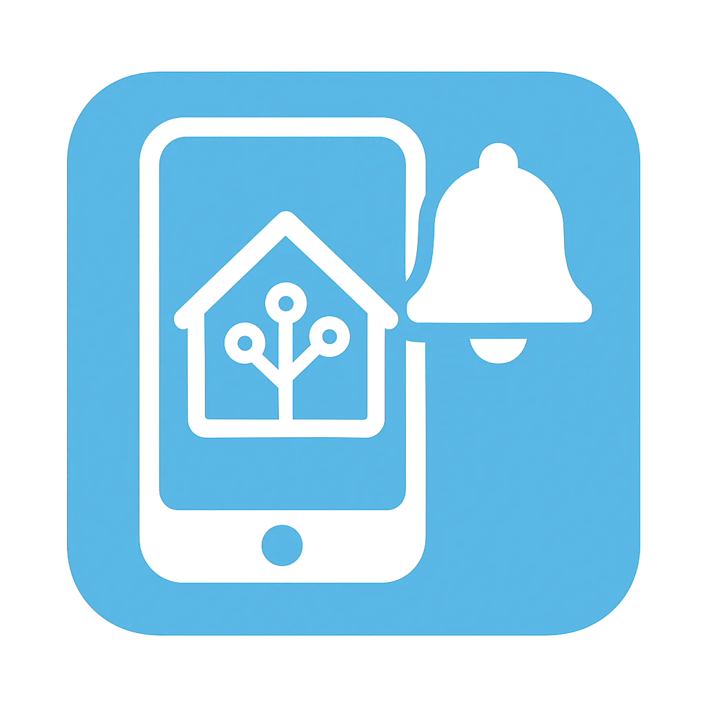

# Notify Manager

<p align="center">
  
</p>

<p align="center">
  <strong>Vollständige Benachrichtigungsverwaltung für Home Assistant</strong><br>
  100% der Companion App Features - einfach und übersichtlich
</p>

<p align="center">
  <a href="https://github.com/gz1337/ha-notify-manager/releases"></a>
  <a href="https://github.com/hacs/integration"></a>
  <a href="LICENSE"></a>
</p>

---

## 📋 Changelog

### v1.2.3.3
- ✨ **Neuer Sensor "Letzter Button"** - Trackt den zuletzt geklickten Button für einfache Automations-Conditions
- 💾 **Persistente Vorlagen** - Vorlagen werden in HA Storage gespeichert (überleben Neustarts)
- 🔌 **WebSocket API** - Automatische Synchronisation zwischen Frontend und Backend
- 📝 **Verbessertes "Aus Vorlage senden"** - Dropdown mit Standard-Vorlagen + eigene Eingabe möglich
- 🎯 **Button-Conditions** - Dropdown-Auswahl für alle bekannten Button-Actions
- 🖼️ **Automatisches Icon-Setup** - Brand-Icons werden automatisch installiert

### v1.2.3
- Button-Editor mit einzelnen Feldern statt Tabelle
- Button-Vorlagen-Auswahl im Service
- `send_from_template` Service

### v1.2.0
- Device Triggers, Conditions und Actions
- Button-Entities, Select-Entities
- Sidebar-Toggle

### v1.1.0
- 18 Services für alle Companion App Features
- Frontend-Panel mit 6 Tabs

---

## ✨ Features

### Grundfunktionen
- 🔔 **Zentrale Benachrichtigungsverwaltung** - Alle Companion App Features an einem Ort
- 📱 **iOS & Android** - Vollständige Unterstützung für beide Plattformen
- 🎛️ **Eigenes Frontend-Panel** - Mit Vorlagen- und Gruppen-Manager
- 👥 **Gerätegruppen** - Sende an mehrere Geräte gleichzeitig
- 📋 **Vorlagen** - Speichere häufig genutzte Benachrichtigungen

### Benachrichtigungstypen
- 🔘 **Actionable Notifications** - Interaktive Buttons
- 📷 **Kamera-Snapshots** - Bilder direkt in der Benachrichtigung
- 🎬 **Video & Audio** - Medien-Anhänge
- ✏️ **Text-Eingabe** - Benutzer können antworten
- 🗺️ **Karten mit Pin** - Standort-Benachrichtigungen (iOS)
- 📊 **Fortschrittsbalken** - Progress-Anzeige (Android)
- ⏱️ **Timer/Countdown** - Chronometer (Android)
- 🔊 **Text-to-Speech** - Text vorlesen (Android)

### Erweiterte Features
- 🚨 **Kritische Benachrichtigungen** - Durchbrechen Nicht-Stören (iOS)
- 📲 **20+ Geräte-Befehle** - Steuere Android-Geräte
- 🔴 **Badge-Steuerung** - App-Badges setzen/löschen (iOS)
- ⌚ **Apple Watch** - Complications aktualisieren
- 📱 **Widgets** - iOS Home Screen Widgets aktualisieren

---

## 📦 Installation

### HACS (Empfohlen)

1. Öffne **HACS** in Home Assistant
2. Klicke auf die **drei Punkte** (⋮) oben rechts
3. Wähle **Benutzerdefinierte Repositories**
4. Füge hinzu:
   - **Repository**: `https://github.com/gz1337/ha-notify-manager`
   - **Kategorie**: `Integration`
5. Klicke **Hinzufügen**
6. Suche nach **Notify Manager** und installiere
7. **Starte Home Assistant neu**

### Manuelle Installation

1. Lade das [neueste Release](https://github.com/gz1337/ha-notify-manager/releases) herunter
2. Kopiere `custom_components/notify_manager` nach `config/custom_components/`
3. Starte Home Assistant neu

---

## ⚙️ Einrichtung

1. Gehe zu **Einstellungen** → **Geräte & Dienste**
2. Klicke **+ Integration hinzufügen**
3. Suche nach **Notify Manager**
4. Wähle deine Companion App Geräte aus
5. Fertig! "Notify Manager" erscheint in der Sidebar

---

## 🚀 Verfügbare Services (18 total)

### Basis-Services

| Service | Beschreibung |
|---------|--------------|
| `send_notification` | 📱 Einfache Benachrichtigung |
| `send_actionable` | 🔘 Mit Buttons |
| `send_with_image` | 📷 Mit Bild/Kamera |
| `send_alarm_confirmation` | 🚨 Alarm-Vorlagen |
| `send_text_input` | ✏️ Mit Texteingabe |
| `clear_notifications` | 🗑️ Löschen |

### Erweiterte Services

| Service | Beschreibung | Plattform |
|---------|--------------|-----------|
| `send_tts` | 🔊 Text vorlesen | Android |
| `send_map` | 🗺️ Karte mit Pin | iOS |
| `send_media` | 🎬 Video/Audio | Beide |
| `send_progress` | 📊 Fortschrittsbalken | Android |
| `send_chronometer` | ⏱️ Timer/Countdown | Android |
| `send_advanced` | ⚙️ Alle Optionen | Beide |

### Steuerungs-Services

| Service | Beschreibung | Plattform |
|---------|--------------|-----------|
| `device_command` | 📲 20+ Geräte-Befehle | Android |
| `request_location_update` | 📍 Standort anfordern | Beide |
| `update_widgets` | 🔄 Widgets aktualisieren | iOS |
| `update_complications` | ⌚ Watch aktualisieren | iOS |
| `set_badge` | 🔢 Badge setzen | iOS |
| `clear_badge` | 🔴 Badge löschen | iOS |

---

## 📝 Beispiele

### Einfache Benachrichtigung

```yaml
service: notify_manager.send_notification
data:
  title: "Willkommen"
  message: "Du bist zu Hause!"
  priority: normal
```

### Mit Buttons

```yaml
service: notify_manager.send_actionable
data:
  title: "🔔 Türklingel"
  message: "Jemand ist an der Tür!"
  target:
    - iphone_max
  actions:
    - action: "DOOR_OPEN"
      title: "🔓 Öffnen"
    - action: "DOOR_IGNORE"
      title: "Ignorieren"
  priority: high
  tag: doorbell
```

### Mit Kamera-Snapshot

```yaml
service: notify_manager.send_with_image
data:
  title: "📷 Bewegung"
  message: "Bewegung an der Haustür erkannt"
  camera_entity: camera.haustuer
  priority: high
  actions:
    - action: "VIEW_LIVE"
      title: "Live ansehen"
```

### Text vorlesen (Android)

```yaml
service: notify_manager.send_tts
data:
  tts_text: "Achtung, die Waschmaschine ist fertig!"
  media_stream: alarm_stream
  target:
    - pixel_7
```

### Fortschrittsbalken (Android)

```yaml
service: notify_manager.send_progress
data:
  title: "Download"
  message: "Datei wird heruntergeladen..."
  progress: 75
  tag: download_progress
```

### Geräte-Befehl (Android)

```yaml
service: notify_manager.device_command
data:
  command: command_dnd
  data:
    command: "off"
  target:
    - pixel_7
```

### Alle Optionen (Advanced)

```yaml
service: notify_manager.send_advanced
data:
  title: "Test"
  message: "Nachricht mit allen Optionen"
  target:
    - iphone_max
  # iOS
  sound: "default"
  critical: true
  badge: 5
  interruption_level: "time-sensitive"
  subtitle: "Untertitel"
  # Android
  channel: "alerts"
  importance: "high"
  color: "#FF0000"
  led_color: "red"
  vibration_pattern: "100, 1000, 100"
  notification_icon: "mdi:bell"
  car_ui: true
  # Allgemein
  group: "alerts"
  tag: "test_123"
  sticky: true
  persistent: true
  timeout: 300
  click_action: "/lovelace/cameras"
  # Anhänge
  image: "/local/photo.jpg"
  video: "/media/local/clip.mp4"
  camera_entity: camera.front_door
  # Buttons
  actions:
    - action: "CONFIRM"
      title: "✓ OK"
      icon: "sfsymbols:checkmark.circle"
    - action: "DISMISS"
      title: "✗ Abbrechen"
      destructive: true
```

---

## 🔄 Auf Button-Klicks reagieren

```yaml
automation:
  - alias: "Türklingel - Tür öffnen"
    trigger:
      - platform: event
        event_type: mobile_app_notification_action
        event_data:
          action: "DOOR_OPEN"
    action:
      - service: lock.unlock
        target:
          entity_id: lock.haustuer
      - service: notify_manager.clear_notifications
        data:
          tag: doorbell
```

---

## 📲 Android Geräte-Befehle

Der `device_command` Service unterstützt:

| Befehl | Beschreibung |
|--------|--------------|
| `command_dnd` | Nicht stören |
| `command_ringer_mode` | Klingelton |
| `command_volume_level` | Lautstärke |
| `command_screen_on` | Bildschirm an |
| `command_screen_brightness_level` | Helligkeit |
| `command_flashlight` | Taschenlampe |
| `command_bluetooth` | Bluetooth |
| `command_high_accuracy_mode` | GPS High-Accuracy |
| `command_webview` | Dashboard öffnen |
| `command_launch_app` | App starten |
| `command_media` | Medien-Steuerung |
| `command_update_sensors` | Sensoren aktualisieren |
| `command_stop_tts` | TTS stoppen |
| `command_broadcast_intent` | Intent senden |
| `command_activity` | Activity starten |
| `command_app_lock` | App-Sperre |
| `command_persistent_connection` | Dauerverbindung |
| `command_ble_transmitter` | BLE Transmitter |
| `command_beacon_monitor` | Beacon Monitor |
| `remove_channel` | Kanal entfernen |

---

## 🎛️ Frontend-Panel

Das Panel bietet:

- **📤 Senden** - Schnell Benachrichtigungen testen
- **📋 Vorlagen** - Eigene Vorlagen erstellen und verwalten
- **👥 Gruppen** - Gerätegruppen für Mehrfach-Versand
- **❓ Hilfe** - Kurzanleitung

---

## 🐛 Fehlerbehebung

### Keine Geräte gefunden
- Companion App installiert und verbunden?
- Benachrichtigungen in der App erlaubt?

### Benachrichtigungen kommen nicht an
- Kategorie aktiviert?
- Teste mit `notify.mobile_app_xxx` direkt

### Panel wird nicht angezeigt
- Browser-Cache leeren
- Home Assistant neu starten

---

## 📄 Lizenz

MIT License - siehe [LICENSE](LICENSE)
